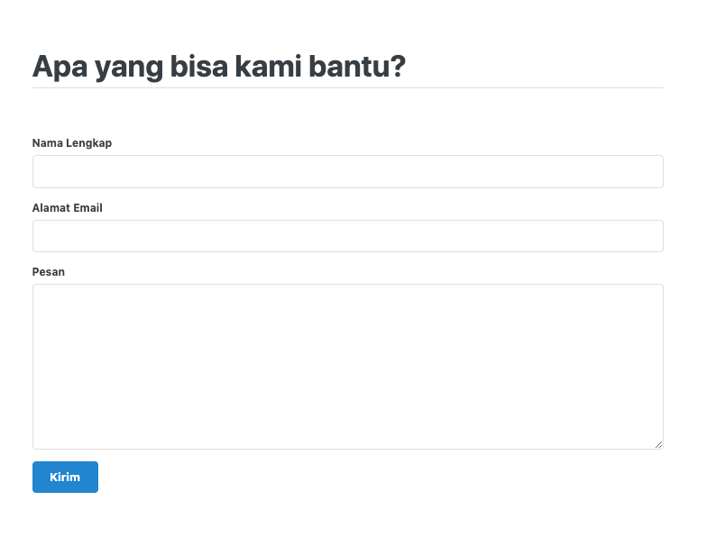
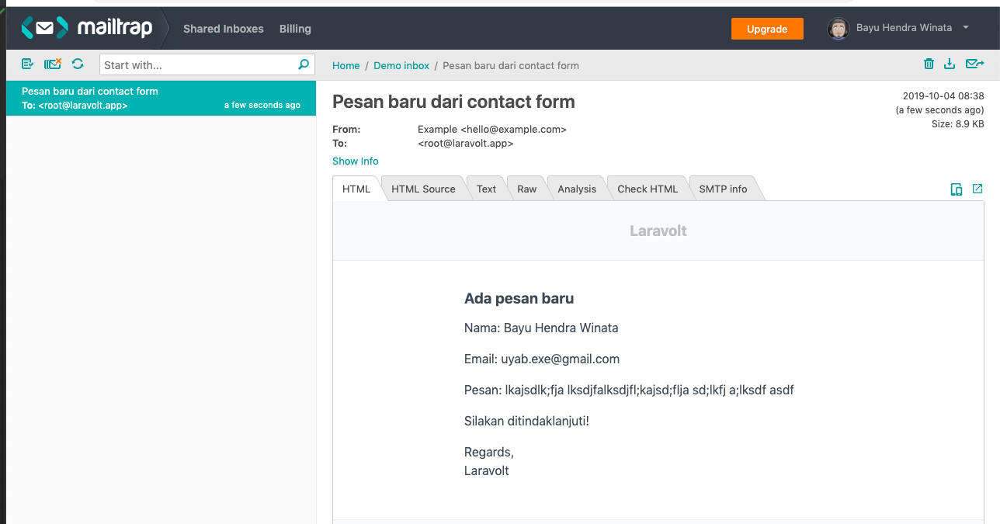

# Contact Form

Kita akan membuat sebuah *contact form* sederhana seperi gambar di bawah ini:



## Persiapan

Untuk memulai, silakan ikuti instruksi berikut ini:

1. **Fork** (bukan clone) repository https://github.com/laravolt/playground ke akun masing-masing.
2.  Clone repo hasil fork tersebut ke perangkat masing-masing.
3. Pindah ke branch `contact-form`.
4. Setup environment:
    - Buat satu buah database.
    - copy file `.env.example` ke `.env`, sesuaikan isinya.
    - Jalankan `composer install`
    - Jalankan `php artisan serve` dan pastikan terlihat halaman login Laravolt di browser.
    - Halaman contact form bisa diakses di `/contact-form`.
5. Untuk setiap task di bawah, lakukan 1 buah commit. **Jangan menumpuk commit di belakang**.


## Ringkasan Misi

Dari skeleton aplikasi contact form, Anda diminta untuk menyelesaikan misi di bawah:

1. Memvalidasi form
    - Semua field wajib diisi
    - Format email harus valid
    - Panjang pesan minimal 20 karakter
    - Nama lengkap **minimal 3 suku kata**, jika kurang dari 3 suku kata, menampilkan pesan "Nama harus mengandung 3 suku kata atau lebih"
2. Menyimpan hasil inputan form ke database
    - Membuat migration scripts
    - Membuat model `\App\Models\ContactForm`
    - Menyimpan via *query builder*
    - Menyimpan via *model instance*
    - Menyimpan via *mass assignment*
    - Menampilkan pesan sukses "Pesan telah diterima dan menunggu tindak lanjut"
    - Kembali ke halaman `contact-form`
3. Notifikasi admin via email ketika ada yang mengisi contact form
    - Membuat `Event`
    - Membuat `Listener`
    - Memasangkan `Event` dan `Listener`
    - Membuat `Notification`
    - Simulasi mengirim email menggunakan Mailtrap.io


## Misi 1: Form & Validasi


### 1. Mendefinisikan Route

Daftarkan 2 buah route baru di `routes/web.php`, masing-masing untuk menampilkan form (GET) dan menyimpan form (POST).

```php
Route::get('contact-form', 'ContactFormController@create')->name('contact-form.create');
Route::post('contact-form', 'ContactFormController@store')->name('contact-form.store');
```


### 2. Membuat Controller

#### 2.1. Jalankan Generator

Buka terminal dan jalankan Artisan CLI untuk menggenerate Controller secara otomatis:

```bash
php artisan make:controller ContactFormController
```

#### 2.2. Tambahkan Method `create` dan `store`

```php
public function create()
{
    return view('contact-form.create');
}

public function store(Request $request)
{
    //
}
```


### 3. Tambahkan View

Membuat skeleton view di `resources/views/contact-form/create.blade.php`.

```php+HTML
@extends('ui::layouts.centered')
@section('content')

@stop
```


### 4. Membuat Form

Memanfaatkan semantic-form untuk memudahkan pembuatan form HTML.

```php+HTML
@extends('ui::layouts.centered')
@section('content')
    <h1 class="ui header dividing m-b-2">Apa yang bisa kami bantu?</h1>
    {!! form()->post(route('contact-form.create')) !!}
    {!! form()->text('name')->label('Nama Lengkap') !!}
    {!! form()->email('email')->label('Alamat Email') !!}
    {!! form()->textarea('message')->label('Pesan') !!}
    {!! form()->submit('Kirim') !!}
    {!! form()->close() !!}
@stop
```


### 5. Validasi Form


#### 5.1. Generate `FormRequest`

 ```bash
 php artisan make:request ContactForm/Store
 ```


#### 5.2. Modifikasi `rules()` dan `authorize()` 

```php
<?php

namespace App\Http\Requests\ContactForm;

use Illuminate\Foundation\Http\FormRequest;

class Store extends FormRequest
{
    /**
     * Determine if the user is authorized to make this request.
     *
     * @return bool
     */
    public function authorize()
    {
        return true; // sebelumnya false
    }

    /**
     * Get the validation rules that apply to the request.
     *
     * @return array
     */
    public function rules()
    {
        return [
            'name' => ['required'],
            'email' => ['required'],
            'message' => ['required'],
        ];
    }
}

```


#### 5.3. Pasangkan ke `ContactFormController@store`

```php
public function store(\App\Http\Requests\ContactForm\Store $request)
{
    //
}
```

Silakan coba submit form. Sampai sini kita sudah berhasil menyelesaikan task pertama: semua field wajib diisi.

Untuk menambahkan validasi format email dan panjang pesan juga cukup mudah karena sudah disediakan oleh Laravel.

```php
public function rules()
{
    return [
        'name' => ['required'],
        'email' => ['required', 'email'],
        'message' => ['required', 'min:20'],
    ];
}
```

Daftar lengkap validasi yang sudah tersedia bisa dilihat di https://laravel.com/docs/master/validation#available-validation-rules. 

Selanjutnya kita harus membuat *custom validation rule* untuk validasi yang aneh-aneh, yang biasanya sangat spesifik sesuai kebutuhan aplikasi.


#### 5.4. Membuat Custom Validation Rule

Jalankan perintah `php artisan make:rule MinimumWords`


#### 5.5. Implementasi Rule

```php
<?php

namespace App\Rules;

use Illuminate\Contracts\Validation\Rule;

class MinimumWords implements Rule
{
    /**
     * @var int
     */
    protected $limit;

    /**
     * Create a new rule instance.
     *
     * @param mixed $limit
     */
    public function __construct($limit = 3)
    {
        $this->limit = $limit;
    }

    /**
     * Determine if the validation rule passes.
     *
     * @param string $attribute
     * @param mixed  $value
     *
     * @return bool
     */
    public function passes($attribute, $value)
    {
        return str_word_count($value) >= $this->limit;
    }

    /**
     * Get the validation error message.
     *
     * @return string
     */
    public function message()
    {
        return ":attribute harus mengandung {$this->limit} suku kata atau lebih";
    }
}
```


#### 5.6. Daftarkan Custom Rule Ke FormRequest

```php
public function rules()
{
    return [
        'name' => ['required', new \App\Rules\MinimumWords(2)],
        'email' => ['required', 'email'],
        'message' => ['required', 'min:20'],
    ];
}
```


> ##### 👨🏼‍💻 Misi Tambahan
>
> Tambahkan validasi untuk memastikan hanya email dari lembaga resmi di Indonesia yang boleh dimasukkan. Alamat email dianggap valid jika berakhiran `.go.id`, `.ac.id`, atau `.or.id`.


## Misi 2: Menyimpan ke Database

### 1. Membuat Model

`php artisan make:model Models/ContactForm`

### 2. Membuat Migration Script

`php artisan make:migration create_contact_forms_table`


> Model dan migration script bisa digenerate sekaligus dengan flag `-m`:
>
> `php artisan make:model Models/ContactForm -m`

### 3. Menyimpan Data

#### 3.1. Menyimpan via Query Builder

```php
use Illuminate\Support\Facades\DB;

// Define kolom satu per satu, bayangkan kalau kolomnya ada belasan atau puluhan 🤦
DB::table('contact_forms')->insert([
     'name' => $request->name,
     'email' => $request->email,
     'message' => $request->message,
]);

// Cara lebih ringkas
DB::table('contact_forms')->insert($request->only(['name', 'email', 'message']));
DB::table('contact_forms')->insert($request->except(['_token']));
DB::table('contact_forms')->insert($request->validated()); //⭐
```


#### 3.2. Menyimpan via Model Instance

```php
use App\Models\ContactForm;

// Cara paling lumrah dan paling OOP, tapi kasusnya sama seperti di atas, kita harus mendefinisikan mapping kolom satu per satu.
$contactForm = new ContactForm();
$contactForm->name = $request->name;
$contactForm->email = $request->email;
$contactForm->message = $request->message;
$contactForm->save();
```


#### 3.3. Menyimpan via Mass Assigment ⭐

```php
use App\Models\ContactForm;

// Cara paling direkomendasikan, ringkas namun tetap "Eloquent Ways"
ContactForm::create($request->validated());
```

Cara di atas bisa dilakukan hanya jika kita mendefinisikan `$guarded` atau `$fillable` di model `ContactForm`.

```php
class ContactForm extends Model
{
    // protected $fillable = ['name', 'email', 'message'];

    protected $guarded = [];
}
```

`$fillable` itu *whitelist*, hanya atribut yang disebutkan disitu yang bisa dilakukan *mass assignment*. Sedangkan `$guarded` bersifat *blacklist*, atribut yang disebutkan disitu tidak boleh dilakukan *mass assignment*.


> #####  ⭐ Laravolt Best Practice
>
> Kosongkan `$guarded` (set sebagai *empty array* seperti contoh di atas), tapi pastikan selalu memanggil `$request->validated()` atau `$request->only()` atau  `$request->except()` **dan bukan**  `$request->all()` di *Controller*. Ini akan membuat *Controller* lebih ringkas dan mudah dibaca.

Referensi: https://medium.com/@sager.davidson/fillable-vs-guarded-hint-they-both-lose-f278bc81dedf


### 4. Menampilkan Pesan Sukses

```php
return redirect()->back()->withSuccess('Pesan telah diterima dan menunggu tindak lanjut.');
```

Selain `withSuccess()`, Laravolt juga secara otomatis mengenali `withInfo()`, `withWarning()`, dan `withError()`.


## Misi 3: Mengirim Email Notifikasi

### 1. Menyiapkan Event + Listener


#### 1.1. Dispatch Event

Modifikas kelas `ContactFormController` menjadi seperti berikut:

```php
// Simpan model yang disimpan ke database dalam sebuah variable
$contactForm = ContactForm::create($request->validated());

// Dispatch event. Tugas event hanya mengabarkan dan menyediakan data (variable) yang sekiranya berguna bagi kelas lain yang nanti akan memprosesnya.
event(new \App\Events\ContactFormSubmitted($contactForm));
```

Sampai disini kita bisa mencoba mensubmit lagi contact form, tapi pasti akan menemui error karena kelas `\App\Events\ContactFormSubmitted` belum dibuat.


#### 1.2. Generate Event

Selanjutnya kita bisa membuat kelas event baru dengan nama `ContactFormSubmitted` memanfaatkan artisan CLI:

```bash
php artisan make:event ContactFormSubmitted
```

Sesuaikan isinya sesuai kebutuhan. Pada umumnya kelas `Event` tidak perlu mengandung *logic* sama sekali. Kelas ini hanya bertugas sebagai **kurir** yang menerima *variable* untuk kemudian diproses oleh kelas lain yang menjadi *listener*-nya.

```php
<?php

namespace App\Events;

use App\Models\ContactForm;

class ContactFormSubmitted
{
    public $contactForm;

    public function __construct(ContactForm $contactForm)
    {
        $this->contactForm = $contactForm;
    }
}

```


#### 1.3. Generate Listener

```bash
pa make:listener SendContactFormNotification -e ContactFormSubmitted
```

Perhatikan flag `-e` pada perintah di atas. Fungsinya adalah sebagay `type-hinted` pada kelas Listener agar Laravel secara otomatis bisa mengenali bahwa listener `SendContactFormNotification` ini akan dieksekusi setiap kali ada event `ContactFormSubmitted`.

Perintah di atas akan menghasilkan skeleton kelas sebagai berikut:

```php
<?php

namespace App\Listeners;

use App\Events\ContactFormSubmitted;
use Illuminate\Contracts\Queue\ShouldQueue;
use Illuminate\Queue\InteractsWithQueue;

class SendContactFormNotification
{
    /**
     * Create the event listener.
     *
     * @return void
     */
    public function __construct()
    {
        //
    }

    /**
     * Handle the event.
     *
     * @param ContactFormSubmitted $event
     * @return void
     */
    public function handle(ContactFormSubmitted $event)
    {
    }
}
```

Silakan tambahkan method `dd($event->contactForm)` di dalam method `handle` dan coba submit form sekali lagi. Cek apakah listener dieksekusi.

#### 1.4. Mendaftarkan Event dan Listenernya

##### 1.4.1. Via EventServiceProvider

Buka file `App\Providers\EventServiceProvider` dan sesuaikan bagian `$listen`:

```php
protected $listen = [
    \App\Events\ContactFormSubmitted::class => [
        \App\Listeners\SendContactFormNotification::class,
        "App\Listeners\AnotherListener",
    ],
];
```

Satu event bisa memiliki banyak banyak listener. Hal ini memungkinkan kita untuk menambah fungsionalitas sistem tanpa perlu memodifikasi *core* aplikasi.

Referensi: https://laravel.com/docs/master/events#registering-events-and-listeners

##### 1.4.2. Via Event Discovery

Sejak Laravel 5.8.9, kita tidak perlu mendaftarkan pasangan event dan listenernya secara manual. Laravel secara otomatis akan mendeteksi berdasar *type-hinted* di parameter method. Untuk menggunakan fitur ini, kita harus mengaktifkan dulu *Event Discovery* dengan cara meng-*override* method di `EventServiceProvider`:

```php
public function shouldDiscoverEvents()
{
    return true;
}
```

Buka kembali listener `SendContactFormNotification` yang sudah dibuat sebelumnya:

```php
public function handle(ContactFormSubmitted $event)
{
}
```

Pada method `handle` ini kita bisa melihat bahwa ada *type-hint* yang merefer ke kelas `App\Events\ContactFormSubmitted`. Ketika *Event Discovery* di-enable, maka listener akan otomatis dieksekusi ketika ada event `ContactFormSubmitted`.

Referensi: https://laravel.com/docs/master/events#event-discovery

### 

## 2. Menyiapkan Email Notifikasi

### 2.1. Generate Notification

Jalankan kembali Artisan CLI:

```bash
php artisan make:notification ContactFormSubmitted
```

Sebuah file baru akan digenerate di folder `app\Notifications`. 

### 2.2. Siapkan Konten Email

Ada 2 method yang perlu dimodifikasi, yaitu bagian `constructor` dan `toMail`:

```php
<?php

namespace App\Notifications;

use App\Models\ContactForm;
use Illuminate\Bus\Queueable;
use Illuminate\Contracts\Queue\ShouldQueue;
use Illuminate\Notifications\Messages\MailMessage;
use Illuminate\Notifications\Notification;

class ContactFormSubmitted extends Notification
{
    use Queueable;

    /**
     * @var ContactForm
     */
    protected $contactForm;

    /**
     * Create a new notification instance.
     *
     * @return void
     */
    public function __construct(ContactForm $contactForm)
    {
        //
        $this->contactForm = $contactForm;
    }

    /**
     * Get the notification's delivery channels.
     *
     * @param mixed $notifiable
     * @return array
     */
    public function via($notifiable)
    {
        return ['mail'];
    }

    /**
     * Get the mail representation of the notification.
     *
     * @param mixed $notifiable
     * @return \Illuminate\Notifications\Messages\MailMessage
     */
    public function toMail($notifiable)
    {
        return (new MailMessage)
            ->subject('Pesan baru dari contact form')
            ->greeting('Ada pesan baru')
            ->line('Nama: '.$this->contactForm->name)
            ->line('Email: '.$this->contactForm->email)
            ->line('Pesan: '.$this->contactForm->message)
            ->line('Silakan ditindaklanjuti!');
    }

    /**
     * Get the array representation of the notification.
     *
     * @param mixed $notifiable
     * @return array
     */
    public function toArray($notifiable)
    {
        return [
            //
        ];
    }
}
```

Referensi: https://laravel.com/docs/master/notifications#mail-notifications


### 2.3. Menyiapkan SMTP Untuk Simulasi Email

Untuk simulasi pengiriman menggunakan SMTP, silakan ikuti tutorial di https://www.malasngoding.com/kirim-email-dengan-laravel/.


### 2.4. Mengetes Kelas Notification

Untuk mengetes kelas Notification, kita bisa memanfaatkan [tinker](https://laravel.com/docs/master/artisan#tinker) ataupun [web tinker](https://github.com/spatie/laravel-web-tinker). FYI, repo `laravolt/playground` sudah terpasang web tinker. Untuk mengaksesnya bisa mengetikkan url `/tinker` di browser.

Selanjutnya, yang dibutuhkan untuk mengirim notifikasi hanya sebuah object `App\User` dan object lain sesuai kebutuhan `constructor` dari kelas Notification. Menggunakan contoh di atas, maka kita membutuhkan juga sebuah object `\App\Models\ContactForm`. Mari kita simulasikan.

```php
// Kita anggap user pertama adalah admin
$admin = \App\User::first(); 

// Ambil record pertama contact form
$contactForm = \App\Models\ContactForm::find(1); 

// Mengirim notifikasi
$admin->notify(new \App\Notifications\ContactFormSubmitted($contactForm));
```




Ada beberapa cara untuk mengirim notifikasi ke user tertentu. Contoh di atas menggunakan `Notifiable` trait yang sudah dimiliki oleh kelas `User` sehingga kita tinggal memanggil method `notify()`. Cara lainnya bisa dibaca mandiri pada link di bawah.	

Referensi: https://laravel.com/docs/master/notifications#using-the-notifiable-trait


## 3. Mengirim Notifikasi Ke Admin

Sejauh ini kita sudah membuat:

1. Event yang ditrigger ketika submit contact form.
2. Listener yang akan dieksekusi ketika ada event submit contact form
3. Dan sebuah kelas Notification untuk mengirim email

Langkah terakhir yang diperlukan adalah memindahkan eksekusi pengiriman notifikasi email ke dalam fungsi `handle` dari listener yang sudah kita buat.

```php
public function handle(ContactFormSubmitted $event)
{
    $admin = User::first();
    $admin->notify(new \App\Notifications\ContactFormSubmitted($event->contactForm));
}
```


> ##### 👨🏼‍💻 Misi Tambahan
>
> Tambahkan fungsionalitas untuk mengirimkan notifikasi email ke alamat email pengirim (sesuai yang diisikan di contact form).
>
> Referensi: https://laravel.com/docs/master/notifications#on-demand-notifications
>
> 

That's All. Silakan dicoba kembali submit form melalui halaman web dan cek apakah ada email masuk ke mailtrap.

...


Sampai jumpa di misi berikutnya.

