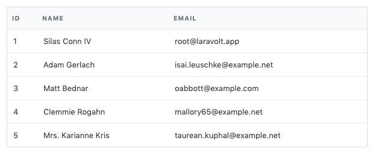

# Suitable

## Intro

Suitable adalah helper untuk menampilkan data dari Eloquent menjadi tabel (datatable) dengan struktur HTML sesuai standard Fomantic UI. Fitur-fitur yang tersedia:

1. Membuat datatable cukup 1 baris
2. Column sorting (server side)
3. Column filtering (server side)
4. Searching (server side)
5. Ekspor ke PDF, CSV, XLS, XLSX (server side)
6. Pagination (server side)
7. Custom column definition

Semua pengolahan data dilakukan di server side tanpa bantuan Javascript. Untuk meningkatkan response time ketika melakukan navigasi, sangat disarankan untuk menggunakan teknologi seperti:

- [Turbolinks](https://github.com/turbolinks/turbolinks)
- [Pjax (Versi jQuery)](https://github.com/defunkt/jquery-pjax)
- [Pjax (Versi Non jQuery)](https://github.com/MoOx/pjax)
- https://swup.js.org/

Penggunaan salah satu teknologi di atas memungkinkan untuk melakukan transisi halaman web secara lebih halus, tanpa full page refresh. Aplikasi web bisa dibuat seolah-olah mirip Single Page Application, meskipun stack yang digunakan murni server side rendering.

## Cara Pemakaian

Ada 2 cara menampilkan tabel menggunakan Suitable, yaitu sebagai HTML Builder atau sebagai TableView. Sebagai HTML Builder, kamu langsung memanggil helper class `Suitable` untuk mendefinisikan tabel yang ingin dihasilkan. Builder hanya bertugas menghasilkan `string` HTML. Titik.

Sedangkan sebagai TableView, sebuah tabel direpresentasikan dalam sebuah kelas `TableView` dimana kelas ini selain bertanggung jawab menghasilkan string HTML juga dapat digunakan untuk memanipulasi response dari `Controller`, misalnya untuk menghasilkan file PDF atau spreadsheet.

## HTML Builder

Penggunaan paling sederhana Suitable adalah sebagai HTML builder, dimana Suitable dapat menghasilkan tag HTML untuk menampilkan data dalam bentuk tabel. Output yang dihasilkan, setelah memanggil method `render()`, hanyalah string biasa. Oleh karena itu, pemanggilan Suitable bisa dilakukan dimana saja.

Memanggil `render()` langsung di view:

###### resources/views/users/index.blade.php

```php
{!! Suitable::source($data)->columns(['id','name'])->render() !!}
```

Atau bisa juga menyimpan string hasil `render()` ke sebuah variable sehingga view tinggal menampilkan saja:

###### UserController.php

```php
public function index()
{
  	$data = \App\User::all();
  	$table = Suitable::source($data)->render();

  return view('users.index', compact('table'));
}
```

###### resources/views/users/index.blade.php

```php
{!! $table !!}
```


### Contoh Pemakaian

##### Basic Table

```php
Suitable::source($users)
  ->columns(['id', 'name', 'email'])
  ->render()
```



##### Custom Header

```php
Suitable::source($users)
  ->columns([
    'id',
    ['header' => 'Nama', 'field' => 'name'],
    ['header' => 'Surel', 'field' => 'email'],
  ])
  ->render()
```


##### Raw HTML

```php
Suitable::source($users)
  ->columns([
    'id',
    ['header' => 'Nama', 'field' => 'name'],
    ['header' => 'Surel', 'raw' => function ($user) {
      return sprintf('<a href="mailto:%s">%s</a>', $user->email, $user->email);
    }],
  ])
  ->render()
```


##### Custom Cell View

###### resources/views/custom-cell.blade.php

```php
// Variable $data secara otomatis tersedia, merupakan item (object Eloquent) untuk row tersebut
Custom cell untuk user dengan ID {{ $data->getKey() }}
```

**Perhatian:** Tidak perlu menambahkan tag `<td>` karena Suitable akan menambahkannya secara otomatis.

###### resouces/views/index.blade.php

```php
Suitable::source($users)
  ->columns([
    'id',
    ['header' => 'Nama', 'field' => 'name'],
    ['header' => 'Custom Cell', 'view' => 'custom-cell'],
  ])
  ->render()
```


##### Custom Row View

Jika ingin membuat struktur row yang kompleks, maka bisa memanfaatkan method `row(string $view)`. Dengan custom row, maka struktur tabel bisa dikreasikan sebebas mungkin, misalnya melakukan merge cell dengan `rowspan`.

###### resources/views/custom-row.blade.php

```html
<tr>
    <td rowspan="2">{{ $data->getKey() }}</td>
    <td><strong>{{ $data->name }}</strong></td>
</tr>
<tr>
    <td>{{ $data->email }}</td>
</tr>
```

###### resources/views/index.blade.php

```php
Suitable::source($users)
  ->columns([
    'id',
    'Name/Email',
  ])
  ->row('custom-row')
  ->render()
```


##### Searchbox

##### Column Filtering

##### Column Sorting

## TableView