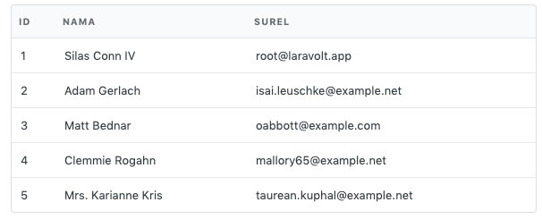
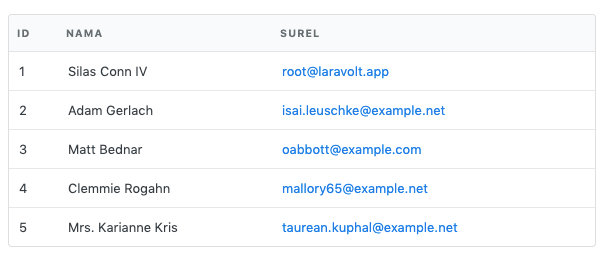
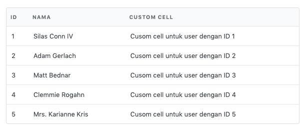

# Suitable

## Intro

Suitable adalah helper untuk menampilkan data dari Eloquent menjadi tabel (datatable) dengan struktur HTML sesuai standard Fomantic UI. Fitur-fitur yang tersedia:

1. Membuat datatable cukup 1 baris
2. Column sorting (server side)
3. Column filtering (server side)
4. Searching (server side)
5. Ekspor ke PDF, CSV, XLS, XLSX (server side)
6. Pagination (server side)
7. Custom column definition

Semua pengolahan data dilakukan di server side tanpa bantuan Javascript. Untuk meningkatkan response time ketika melakukan navigasi, sangat disarankan untuk menggunakan teknologi seperti:

- [Turbolinks](https://github.com/turbolinks/turbolinks)
- [Pjax (Versi jQuery)](https://github.com/defunkt/jquery-pjax)
- [Pjax (Versi Non jQuery)](https://github.com/MoOx/pjax)
- https://swup.js.org/

Penggunaan salah satu teknologi di atas memungkinkan untuk melakukan transisi halaman web secara lebih halus, tanpa full page refresh. Aplikasi web bisa dibuat seolah-olah mirip Single Page Application, meskipun stack yang digunakan murni server side rendering.

## Cara Pemakaian

Ada 2 cara menampilkan tabel menggunakan Suitable, yaitu sebagai HTML Builder atau sebagai TableView. Sebagai HTML Builder, kamu langsung memanggil helper class `Suitable` untuk mendefinisikan tabel yang ingin dihasilkan. Builder hanya bertugas menghasilkan `string` HTML. Titik.

Sedangkan sebagai TableView, sebuah tabel direpresentasikan dalam sebuah kelas `TableView` dimana kelas ini selain bertanggung jawab menghasilkan string HTML juga dapat digunakan untuk memanipulasi response dari `Controller`, misalnya untuk menghasilkan file PDF atau spreadsheet.

## HTML Builder

Penggunaan paling sederhana Suitable adalah sebagai HTML builder, dimana Suitable dapat menghasilkan tag HTML untuk menampilkan data dalam bentuk tabel. Output yang dihasilkan, setelah memanggil method `render()`, hanyalah string biasa. Oleh karena itu, pemanggilan Suitable bisa dilakukan dimana saja.

Memanggil `render()` langsung di view:

###### resources/views/users/index.blade.php

```php
{!! Suitable::source($data)->columns(['id','name'])->render() !!}
```

Atau bisa juga menyimpan string hasil `render()` ke sebuah variable sehingga view tinggal menampilkan saja:

###### UserController.php

```php
public function index()
{
  	$data = \App\User::all();
  	$table = Suitable::source($data)->render();

  return view('users.index', compact('table'));
}
```

###### resources/views/users/index.blade.php

```php
{!! $table !!}
```


### Contoh Pemakaian

##### Basic Table

```php
Suitable::source($users)
  ->columns(['id', 'name', 'email'])
  ->render()
```


##### Custom Header

```php
Suitable::source($users)
  ->columns([
    'id',
    ['header' => 'Nama', 'field' => 'name'],
    ['header' => 'Surel', 'field' => 'email'],
  ])
  ->render()
```



##### Raw HTML

```php
Suitable::source($users)
  ->columns([
    'id',
    ['header' => 'Nama', 'field' => 'name'],
    ['header' => 'Surel', 'raw' => function ($user) {
      return sprintf('<a href="mailto:%s">%s</a>', $user->email, $user->email);
    }],
  ])
  ->render()
```



##### Custom Cell View

###### resources/views/custom-cell.blade.php

```php
// Variable $data secara otomatis tersedia, merupakan item (object Eloquent) untuk row tersebut
Custom cell untuk user dengan ID {{ $data->getKey() }}
```

**Perhatian:** Tidak perlu menambahkan tag `<td>` karena Suitable akan menambahkannya secara otomatis.

###### resouces/views/index.blade.php

```php
Suitable::source($users)
  ->columns([
    'id',
    ['header' => 'Nama', 'field' => 'name'],
    ['header' => 'Custom Cell', 'view' => 'custom-cell'],
  ])
  ->render()
```



##### Custom Row View

Jika ingin membuat struktur row yang kompleks, maka bisa memanfaatkan method `row(string $view)`. Dengan custom row, maka struktur tabel bisa dikreasikan sebebas mungkin, misalnya melakukan merge cell dengan `rowspan`.

###### resources/views/custom-row.blade.php

```html
<tr>
    <td rowspan="2">{{ $data->getKey() }}</td>
    <td><strong>{{ $data->name }}</strong></td>
</tr>
<tr>
    <td>{{ $data->email }}</td>
</tr>
```

###### resources/views/index.blade.php

```php
Suitable::source($users)
  ->columns([
    'id',
    'Name/Email',
  ])
  ->row('custom-row')
  ->render()
```


##### Searchbox

Untuk menampilkan kotak pencarian bisa memanggil method `search()`.

```php
Suitable::source($users)
    ->columns(['id', 'name', 'email'])
    ->search()
    ->render()
```


Melakukan pencarian di searchbox akan membuat terjadinya request ke URL saat ini dengan tambahan query string `?search=<foo>`. Query string `search` tersebut selanjutnya bisa digunakan di Controller untuk melakukan query ke database.

```php
class UserController 
{
    public function index()
    {
        $keyword = request()->get('search');       
        $users = \App\User::where('name', 'like', "%$keyword%")->get();

        // more action here...
    }
}
```

Query string bisa diganti dengan memberikan argumen ke fungsi `search($param)`.

```php
Suitable::source($users)
    ->columns(['id', 'name', 'email'])
    ->search('keyword')
    ->render()
```

Kode di atas akan menghasilkan URL seperti di bawah ini ketika pencarian dilakukan lewat searchbox yang disediakan:

```html
http://localhost/users?keyword=foo
```

Untuk mengganti nama query string secara global, bisa mengubah konfigurasi `laravolt.epicentrum.query_string.search`. 

> File konfigurasi bisa ditemukan di `config/laravolt/epicentrum.php`. 
>
> Jika file konfigurasi tidak tersedia, silakan lakukan langkah *publish vendor file* terlebih dahulu.

##### Column Filtering

Jika ingin menambahkan searchbox untuk kolom tertentu, bisa menambahkan opsi `searchable => <boolean>|<string>`.

```php
Suitable::source($users)
    ->columns([
        'id',
        ['header' => 'Nama', 'field' => 'name', 'searchable' => true],
        ['header' => 'Surel', 'field' => 'email', 'searchable' => 'email_adddress'],
    ])
    ->render()

```


Pencarian bisa dilakukan dengan mengetikkan sesuatu di searchbox lalu **menekan tombol enter**. Pada contoh di atas, URL yang dihasilkan ketika melakukan pencarian adalah:

```html
http://localhost/users?filter[name]=foo&filter[email_address]=bar
```

Selanjutnya, query string `filter` bisa digunakan di Controller untuk melakukan filtering terhadap data yang ditampilkan, misalnya seperti di bawah ini:

```php
class UserController 
{
    public function index()
    {
        $query = \App\User::query();
        $filters = request()->get('filter');               
        foreach ($filters as $column => $keyword) {
            $query->where($column, 'like', "%$keyword%");
        }
		$users = $query->get();
        
        // more action here...
    }
}
```

> Suitable menyediakan Trait [AutoFilter](#auto-filter) yang bisa dipasang di Model. Setelah terpasang,  Model bisa memanggil scope `autoFilter()` dan secara otomatis akan menangani proses filtering data berdasar query string.

##### Column Sorting

Header kolom bisa dibuat agar *clickable* dan menghasilkan query string yang sesuai untuk proses sorting data dengan menambahkan opsi `sortable => <boolean>|<string>`. 

```php
Suitable::source($users)
    ->columns([
        'id',
        ['header' => 'Nama', 'field' => 'name', 'sortable' => true],
        ['header' => 'Surel', 'field' => 'email', 'sortable' => 'email_address'],
    ])
    ->render()
```

Kode di atas akan menghasilkan tabel dengan header kolom berubah menjadi link yang bisa diklik untuk mendukung proses sorting data.


Mengklik salah satu kolom akan menghasilkan URL seperti di bawah ini:

```html
http://localhost/users?sort=name&direction=desc
```

Query string `sort` berisi nama kolom sedangkan `direction` menunjukkan metode sorting apakah `asc` atau `desc`. Kedua query string ini selanjutnya bisa digunakan di Controller untuk melakukan sorting data:

```php
class UserController 
{
    public function index()
    {
        $query = \App\User::query();
        $sort = request()->get('sort');               
        $direction = request()->get('direction');               
        
        if ($sort) {
            $query->orderBy($sort, $direction);
        }
        
        $users = $query->get();
        
        // more action here...
    }
}
```

> Suitable menyediakan Trait [AutoSort](#auto-sort) yang bisa dipasang di Model. Setelah terpasang, Model bisa memanggil scope `autoSort()` dan secara otomatis akan menangani proses sorting data berdasar query string.

## Table View 

## Auto Sort

## Auto Filter

